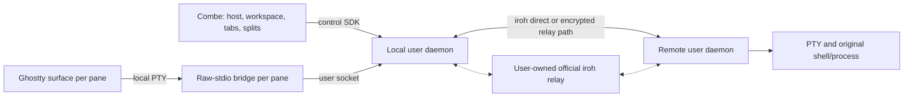

# Proposal: reusable remote terminal component

Status: draft for design review. This document proposes an independent Rust component and its Combe adapter; it does not enable remote access or replace the approved Combe design. Source inspection used Combe `bf1520fec69f1b29b83123701e57cd7c8c17cd0e` and vendored Ghostty `82232ecde55405559dec29c5466cb9e39938cb41`. External documentation was checked on 2026-10-08.

## Recommendation

Build a narrow PTY/session component, reuse `iroh` for authenticated transport, and keep Combe responsible for its existing workspace, tab, split, and terminal UI. Ship a user service, a raw-stdio bridge for each pane, a control SDK, and prebuilt relay deployment assets. Do not implement another terminal parser or renderer.

Two feasibility gates precede the complete adapter: correct terminal recovery through real Ghostty surfaces, and automated user-owned relay deployment within the approved USD 10/month operating boundary. The [G1 prototype](#g1-prototype-results) provides credible feasibility evidence for tested states in both recovery paths, with limits; it does not close the full G1 gate. Relay deployment and cost remain unverified. Keeping a remote process alive is straightforward; restoring its terminal without losing state or repeating effects remains the decisive difficulty.

The strongest simpler session alternative is `shpool` plus a relay agent. Its default restoration loses parser continuation and inactive-screen state in a reproducible synthetic probe. Keeping its original attachment alive avoids that restoration during an ordinary network outage, so the alternative remains credible for that narrower case. A new surface, agent restart, or exhausted output window still requires a complete recovery mechanism.

## Required user outcome

- Enable the capability through Combe CLI and bind another host once. Do not require SSH keys, SSH server setup, port forwarding, or user-developed relay code.
- Selecting a host establishes the target for the existing worktree list, new tabs, and splits. Everyday terminal actions retain their existing meaning and shortcuts.
- Each new pane creates its own remote PTY and shell. A split inherits the remote host and current directory.
- Network disconnects preserve the original remote process. Reconnection attaches to that process; it must not rerun the original command as a substitute.
- The component is reusable by other terminal applications. Owner decision (2026-10-08): start in a separate private Rust repository with a working name; decide the public name and license later.
- Provide native service installation and prebuilt user-owned relay deployment. Owner decision (2026-10-08): use Cloudflare Workers Paid with a USD 10/month operating boundary; evaluate Containers first and use Worker + DO if the Containers candidate exceeds that boundary.

Pairing replaces manual SSH authentication with device authentication; it does not remove authentication. Initial installation must be authorized locally on each machine. Without an existing authorized entrypoint, the component cannot install itself on an inaccessible host.

Command names below are interface proposals, not existing Combe commands or approved UI copy. Binding introduces a host selector; the target is unchanged everyday terminal semantics, not identical network timing or zero new setup steps.

## What a remote terminal consists of

| Layer | Responsibility | Existing capability | Component responsibility |
| --- | --- | --- | --- |
| Terminal emulation | Interpret characters, cursor movement, modes, screens, history; render locally | Full `libghostty` surface | Preserve the renderer and supply a verified recovery adapter |
| Local bridge | Connect the surface's local PTY to remote bytes | Ghostty can spawn a local command | Raw mode, no echo, binary-transparent stdin/stdout, resize forwarding; no logs on stdout |
| Transport | Move input/output, reconnect, control queue growth | No remote transport in Combe | Reuse iroh; add application session offsets, acknowledgements, deduplication and ownership |
| Remote PTY | Spawn shell with cwd, environment and size; retain the process | Ghostty currently does this locally | Daemon owns the PTY independently of network connections |
| Resize and signals | Deliver terminal size and interactive signals | Local PTY semantics | Convert `SIGWINCH` into ordered resize requests; Ctrl-C normally remains PTY input semantics |
| Trust | Authenticate a device and authorize execution | Existing SSH URL only prepares a shell line | Pair and pin device identities; reject unknown or revoked devices |
| Persistence | Reattach to the original session | Local surfaces follow the app lifecycle | Separate create, attach, detach and terminate |
| Roaming and latency | Reconnect after sleep or network changes | Local operations have no network delay | Reuse transport path management; do not add speculative keystroke prediction |

A remote PTY makes a program believe it is attached to an interactive terminal. Its output is still a byte stream; Ghostty turns those bytes into the local terminal state. Resize is a control message, not text. A program's terminal query must receive one appropriate reply, even across disconnect and recovery.

## Architecture and ownership



| Owner | Owns | Does not own |
| --- | --- | --- |
| Rust SDK | Typed host/session operations, events and errors | AppKit, layout, Git parsing |
| Local daemon | Device identity, binding, connections, recovery relationships, pending termination/revocation | Combe layout and workspace ordering |
| Remote daemon | PTY/process, session identity, output sequence, terminal recovery state, cwd/busy/exit | Editor, file synchronization, tabs or window UI |
| Bridge | Local TTY mode, bytes and size forwarding | Authentication UI, recovery algorithm, SSH subprocess |
| Relay and installer | Encrypted routing, admission, deployment and owned-resource cleanup | PTY, terminal plaintext, command execution, terminal recordings |
| Combe adapter | Host selection, catalog, registration, tabs/splits, close confirmation, Ghostty surfaces | Cryptography, connection retries, platform service installation |

One release binary may expose service, bridge and setup subcommands. Both hosts may run the same daemon with client and host roles. Each remote PTY has one owner. Local sockets must restrict access to the current OS user; SDK control is not a public network listener.

The local service has a concrete purpose beyond connection sharing: after an offline Quit, Combe is gone, but a confirmed termination request still needs delivery when connectivity returns. The simpler alternative stores intent in the app and sends it on its next launch. That leaves the process running indefinitely if the app is never reopened. Prefer the local service to preserve close semantics; it does not persist layout.

The project remains Rust at its core. Small Cloudflare Worker entrypoint glue may be TypeScript, shipped as prebuilt assets inside the installer. Requiring Rust/Wasm for that glue would add a toolchain without reducing the user's setup work.

## Public interface sketch

These are component responsibilities, not implemented APIs or invented Ghostty bindings. Terminal bytes and lifecycle/control events use separate channels.

| Type or operation | Contract |
| --- | --- |
| `HostId` | Stable public-key identity of the daemon installation for one OS user; aliases are display names, not authorization |
| `RemoteLocation` | `{ host: HostId, path: RemotePath }`; explicit path encoding, no local filesystem validation |
| `SessionRef` | `{ host, id, generation }`; generation prevents stale operations targeting replacement processes |
| `OwnerId`, `RunId`, `PaneKey` | Stable application installation/binding, current app run, and pane recovery relationship; no layout tree |
| `bind(invite)`, `revoke(host)` | One-time authenticated pairing; revocation invalidates existing and future access |
| `hosts()`, `watch_hosts()` | Bound devices and connection state |
| `resolve_location(host, path)`, `stat(host, path)` | Bounded directory facts for registration and cleanup; no general file download API |
| `run(host, argv, cwd, limits)` | Authorized non-PTY execution with separate stdout/stderr/exit, deadline and output bounds |
| `create(owner, run, pane, location, shell, size, request_id)` | Idempotent creation of one PTY, returning `SessionRef`; structured parameters, not shell concatenation |
| `cancel_create(owner, run, request_id)` | Cancel a pane still being created; late replies cannot leave an orphan shell |
| `attach(session, resume_token, renderer_caps)` | Return a bridge launch description and recovery requirements; never silently create a new session |
| `resize(session, size, revision)` | Ordered dimensions with a defined recovery boundary |
| `watch_session(session)` | Versioned cwd, busy, exit, connection and recovery events |
| `sessions(owner)` | Authorized sessions with original location, pane/run identity and attachment state |
| `detach(attachment)`, `terminate(session, request_id)` | Detach preserves the process; termination explicitly targets its exact generation |
| `recover(owner, pane)` | Return the original session or `Lost`/`Exited`; never rerun a command |
| `owner_channel(owner, message)` | Authenticated, bounded opaque application messages; Combe interprets CLI/Hop semantics |

`run` is user-account execution, not a read-only Git sandbox. The terminal already allows arbitrary commands under that account. Git-specific RPC would add Git ownership to a reusable terminal component without removing that authority. Every execution entrypoint still requires device and owner authorization, limits and error handling; no root escalation or arbitrary user switching is provided.

Ghostty's command string contains only a correctly quoted trusted bridge executable path. An opaque, non-secret attachment identifier can use `env_vars`. User host/path/command values are not interpolated into that shell string. The surface uses a valid local working directory; the daemon receives the remote cwd separately.

## Session lifecycle

| Event | Proposed behavior | Boundary |
| --- | --- | --- |
| Network loss, sleep or relay restart | Keep remote process and pane; reconnect to the same session | Socket EOF is not user termination |
| Host switch | Preserve panes on both hosts | Do not respawn on selection |
| New tab or split | Create an independent PTY on the selected host | Split inherits typed host/cwd |
| Confirmed pane/workspace close or normal Quit | End sessions currently owned by that app run | Offline termination remains pending until daemon acknowledgement |
| App/bridge crash | Preserve remote process and authorized recovery relationship | Do not treat crash as confirmed close |
| Remote shell exits | Report the real exit and apply Combe's existing pane behavior | Bridge exit is not remote shell exit |
| Remote host reboot or PTY-owner crash | Report the session lost/exited | Service restart cannot resurrect its original PID |
| Daemon update | Delay replacing a PTY owner while sessions are alive | Transparent live upgrades are outside the first version |

Owner decision (2026-10-08): normal Quit ends the sessions owned by that app run. Network persistence does not change normal Quit into detach; offline termination remains pending until acknowledged.

Allocate a create request ID before sending; retain its result so a lost reply cannot create two shells. Output carries session generation and byte offset. Input uses writer epoch and sequence; accepted input is deduplicated within a defined ledger window. Once that window expires, return `UnknownOutcome`/`Expired`, rather than executing again. Exactly-once execution across a daemon crash is not promised.

Each session initially has one writer. Reattachment fences the old writer; delayed input, close and resize from the old attachment cannot affect the new one. Offline user input is disabled rather than queued for surprising later execution. Status travels out of band; inserting “reconnecting” into stdout can corrupt a partial UTF-8 or escape sequence. Do not use Ghostty readonly mode blindly: it also changes close-confirmation behavior.

Persist close intent before removing an offline pane. Pending creation is cancelled by request ID even if no `SessionRef` has arrived. Before the remote acknowledgement, do not claim the process has terminated. Normal Quit targets the current run's owned sessions, not every session belonging to the device.

Proposed crash adoption: a new run queries the same stable `OwnerId`, adopts unclosed sessions without a valid attachment, and opens a new tab in the original workspace. Missing catalog entries fall under that host's Home while retaining the original session cwd. Do not restore the old split tree, order or zoom, steal another live attachment, or adopt a pending termination. This visible recovery behavior needs prototype review before implementation.

## Terminal recovery: the unresolved gate

| Recovery path | Necessary conditions | Required action |
| --- | --- | --- |
| Existing surface and bridge | Original parser state survives; missing output remains continuous | Append only the missing suffix, preserve order and resize boundaries |
| New surface or missing output outside the log window | Original renderer state is gone or bytes have been discarded | Restore an internally consistent checkpoint, then its output suffix, before accepting input |

A transport ACK is not proof that Ghostty parsed output. A bridge's successful PTY write is not a renderer-consumption ACK. A surviving bridge can preserve ordered delivery to the same surface; a rebuilt bridge/surface cannot reuse its offset as proof of restored state.

Investigate `libghostty-vt` as a state mirror, not a second handwritten parser. Enable continuation tracking before the first input byte. Checkpoint requirements include both screens, bounded history, cursor, modes, tab stops, scroll regions, palette, hyperlinks, incomplete VT/UTF-8 input, size, output offset and version.

The current binary snapshot API belongs to an independent VT object; full surfaces have no public snapshot import. Snapshot v1 also omits Kitty image/placement state and resets presentation state such as selection, viewport and search. The public formatter emits the active screen; cell hyperlinks are represented in HTML, not a complete raw-VT reconstruction. It cannot be called a full surface snapshot. See [snapshot API](https://github.com/ghostty-org/ghostty/blob/82232ecde55405559dec29c5466cb9e39938cb41/include/ghostty/vt/snapshot.h), [continuation API](https://github.com/ghostty-org/ghostty/blob/82232ecde55405559dec29c5466cb9e39938cb41/include/ghostty/vt/terminal.h), [snapshot omissions](https://github.com/ghostty-org/ghostty/blob/82232ecde55405559dec29c5466cb9e39938cb41/src/terminal/snapshot/terminal.zig#L230), and [formatter](https://github.com/ghostty-org/ghostty/blob/82232ecde55405559dec29c5466cb9e39938cb41/src/terminal/formatter.zig#L486).

The [G1 prototype](#g1-prototype-results) tested public formatter + continuation + necessary metadata against real full surfaces. Basic formatter + continuation fails; the enhanced recipe fixes the observed positive-case failures through public APIs. If a future demonstrated difference cannot be repaired through public APIs, propose the smallest upstream recovery interface. Do not assume a fork is necessary, invent bindings, or promise recovery because the daemon can save a snapshot.

Terminal query replies and effects need an explicit recovery policy. Simply switching between mirror and surface replies does not prevent a daemon-answered query from being answered again during replay. Bridge stdin cannot reliably distinguish user input from terminal-generated replies. Already delivered OSC 52 clipboard writes, notifications, bells and queries must not repeat. Newly produced effects during disconnection may arrive late; that is a separate issue. Questions that cannot be answered while detached must remain available for the next authorized attachment.

Unlimited raw output, finite resources and complete recovery cannot all be guaranteed. Use checkpoints plus a bounded suffix, targeting Combe's existing 10,000-line history. Eviction may remove history under that contract; it must not corrupt the current terminal or end the process. An exhausted suffix without a valid checkpoint is a visible recovery failure, not success. Validate lengths, integrity and versions before applying state; CRC is not authentication.

Same-surface reconnection must preserve its existing presentation state. A fresh app does not acquire new promises to persist selection or layout, but it still needs a correct terminal state for the original process. G1 must distinguish those contracts.

## G1 prototype results

Executed on 2026-10-08 with pinned Ghostty `82232ecde55405559dec29c5466cb9e39938cb41`, macOS Apple Silicon, Rust 1.96.0 and Zig 0.16.0. The host created real full `libghostty` surfaces in AppKit, each running a bridge child through a real PTY. G1a paused a surviving surface and then delivered its ordered suffix. G1b checkpointed a `libghostty-vt` mirror, decoded the binary snapshot into VT clones, and wrote public formatter output plus reconstruction metadata, canonical continuation and the ordered suffix through the bridge's stdout into a fresh full surface. The full surface did not import a VT snapshot; it consumed reconstruction bytes through its normal child-output path. No Ghostty fork or undeclared binding was needed for the tested states.

One clean `reproduce.sh` run used the final host and complete matrix, rather than merging earlier runs: **76 cases, 1,292 cuts and 2,687 comparison records**. The original 44 cases were retained. Automated observables included public surface text/selection, terminal queries, encoded key/mouse/paste input captured at bridge stdin, hyperlink hover, runtime callbacks and selected pixel captures.

| Area | G1a passes/cuts | Enhanced G1b passes/cuts | Basic formatter + continuation passes/cuts |
| --- | ---: | ---: | ---: |
| Original 44 cases | 919/919 | 919/919 | 56/73 |
| Cell styles and pixels | 27/27 | 27/27 | 20/24 |
| Larger recorded traces | 343/343 | 343/343 | 2/5 |
| Deliberately broken reconstruction controls | 3/3 | 0/3, expected FAIL | Not run |
| Positive totals | 1,289/1,289 | 1,289/1,289 | 78/102 |

Including surviving-surface controls, **G1a passed 1,292/1,292**. Enhanced G1b passed **1,289/1,289 positive cuts**; all three broken reconstruction controls failed as required. Basic formatter + continuation remains inadequate at **78/102**, including failures when leaving alternate screens and using saved cursors. Raw prefix replay also failed because it repeated delivered effects and query replies. Those counterexamples remain part of the evidence, rather than being replaced by the enhanced result.

The larger local recordings totalled 142,255 bytes: coloured `git log --color=always -n 300 --stat` (the checkout contained 62 commits), forced-colour `ls -la -G`, syntax-highlighted Vim editing a 1,449-line source copy with scrolling/splits/visual mode, `less -R` over coloured output, and htop. Each trace combined stage boundaries with at least 50 distinct random byte offsets using fixed seed `20261008`. The original zsh trace remained in the matrix. Recordings exercised actual output streams; they were not live two-host sessions.

### Pixel comparison and negative controls

Both full surfaces used the same size, Monaco 12, surface scale and AppKit backing scale. Public `ghostty_surface_draw` and AppKit `NSView` bitmap caching exported lossless PNGs at 1120 × 768 (860,160 pixels). Decoded RGB pixels were compared exactly, with no tolerance or masked region. Focus was disabled identically, mouse pointers were moved outside, cursor blink was disabled, and style fixtures hid the cursor. Both history viewports were scrolled identically before capture.

All 54 style comparisons had **0/860,160 differing pixels**, covering 16/256/truecolour foreground/background, bold, italic, underline variants, strikethrough, inverse, faint, CJK/emoji/wide-cell wrapping, combined primary/alternate screens and history. Four Vim/less captures also had **0/860,160** differing pixels, including the larger recordings in light appearance. The single run produced 64 captures, including six captures for the three broken controls.

| Negative control | Different pixels | Result |
| --- | ---: | --- |
| Wrong colour, same text | 992 | FAIL |
| Old Vim scroll-region recipe | 37,842 | FAIL |
| Old htop empty-cell recipe | 0 | FAIL: public text differs despite identical pixels |
| Bold removed, added by independent reviewer | 3,523 | FAIL |
| Curly underline removed, added by independent reviewer | 1,537 | FAIL |

The independent review also confirmed the 992-pixel wrong-colour negative. Its additional bold/underline negatives are separate checks, not additions to the 76-case single-run totals. Pixel equality complements text, modes and input checks; it cannot prove hidden state or replace them.

### Passing reconstruction recipe

1. Track the mirror from the first byte with continuation enabled; checkpoint terminal size, source version and output offset with the binary snapshot and bounded history/suffix. Create the fresh surface at checkpoint size with input disabled.
2. Decode public snapshots into clones. Ground a clone with CAN and compare formatter content; for partial UTF-8 where CAN changes content, use a second mirror committed only at ground boundaries. Preserve canonical continuation exactly; it need not equal the raw trailing source bytes.
3. Rebuild both primary and alternate screens, bounded history, saved/current cursors and saved styles/charsets. Use DECRC on clones to expose saved state, DECSC to reconstruct it, and `unwrap=true` to retain soft wrapping. Reset character sets, origin mode and the full scroll region before each repaint.
4. Restore public metadata: actual 47/1047/1049 mode bits, scroll region, tabs, palette, current SGR, input modes, the eight-slot kitty keyboard stack, visible/history hyperlink URIs and the open OSC 8 URI. Preserve pending single shifts through public clone behaviour probes. Use public cell tags/background colours plus ECH for background-only empty cells; do not materialize them as spaces or erase wide-cell spacers.
5. Write ground reconstruction bytes and consume a swallowed terminal marker reply, then canonical continuation and the ordered suffix. Apply ordered resize boundaries and wait for the matching terminal-reported size before sending the suffix; public surface size alone is not a terminal-consumption acknowledgement. Do not insert query markers inside incomplete CSI/OSC/UTF-8 input.
6. Keep input disabled during restoration, swallow **all bridge stdin** during that phase, and suppress already delivered effects. Restore normal input/reply forwarding only at the agreed suffix boundary.

### Observed failures and public-API fixes

| Failure | Cause | Fix exercised by the probe |
| --- | --- | --- |
| Alternate-screen exit; per-screen saved cursor/style | Active-only formatter loses inactive screen and saved state | Public snapshot clones, both-screen painting and DECRC/DECSC reconstruction |
| Charsets, pending wrap, history boundaries | Repainting under old charset; hardening soft wraps; missing final blank rows | Reset charset, `unwrap=true`, public row count/row formatter and pending-wrap reconstruction |
| Kitty keyboard pop; OSC 8 history/open URI; pending single shift | Current flags/text omit stack, cell URI or pending shift | Clone stack pops, public grid/URI metadata, unmutated active clone and behaviour probes |
| Vim cut 9,574 | An inherited scroll region constrained the second repaint and lost a status row | Reset scroll region/origin before repaint, then restore metadata; old recipe retained as a failing control |
| htop empty cells | Formatter replaced background-only null cells with spaces | Public cell tag/background data, ECH and public current-SGR metadata; old recipe retained as a text-failing control |
| Resize with soft wrapping | Host inserted an intermediate size and treated UI size as consumed terminal size | Remove intermediate resize; wait for matching `CSI 18t` / `CSI 8;rows;cols t` response at a ground boundary |
| Repeated effects and replies during raw replay | Historical output emits clipboard/notification/bell/title actions and replies again | State reconstruction instead of raw replay, callback delivery gate and restoration-phase stdin drain |

Every observed positive-case failure was repaired using current public APIs and reconstruction bytes; these failures did not require a new upstream interface. This does not establish that public APIs cover every untested terminal state.

The effects fixture observed continuous callbacks of one clipboard write, notification, bell and title. Enhanced checkpoint restoration emitted no clipboard/notification/bell callback; its one raw title callback was suppressed by the delivery gate. Raw replay repeated all four callbacks and produced 54 bytes of historical query replies. Restoration also produced size/focus reports, including in-band `CSI 48` and `ESC [ I`, and probe-generated consumption/size replies. The bridge must swallow all restoration-phase stdin, including these reports, because byte syntax cannot reliably distinguish replies from user input. Callback counting and a simulated delivery gate did not deliver real system effects or implement a production effect ledger; new suffix effects/replies were compared against the continuous baseline at the same boundary.

Independent review verdict: **“credible with limits” for both G1a and G1b**. This is feasibility evidence for tested states, **not closure of the full G1 gate**. Unverified: real sleep/disconnect; production stdin gating and effect ledger; timing under load; images/Kitty graphics; protected cells/selective erase; explicit hyperlink IDs; mode combinations; non-ground resize; corrupt or cross-version checkpoints. Live two-host application interaction, resource-exhaustion behaviour and comprehensive presentation state also remain outside this evidence. Fresh-surface recovery does not acquire a new promise to persist selection, viewport or search.

## Ghostty build and link feasibility

Build/link probes were executed on 2026-10-08 on Apple Silicon macOS 27.0.1 with Zig 0.16.0 and Rust 1.96.0. Both VT and full libraries were built from a source archive of the pinned Ghostty commit `82232ecde55405559dec29c5466cb9e39938cb41`, with source, caches and outputs outside the repository. Full builds used Combe's existing XCFramework shim and Apple's Metal compiler 32023.921, installed in the user toolchain directory and exposed through `PATH`; Command Line Tools remained selected. This establishes build/link feasibility, not G1 terminal recovery.

The pin contains `include/ghostty/vt/terminal.h`, `snapshot.h` and `formatter.h`, including the public continuation API. Ghostty's install step builds both VT libraries even in Combe's current full-library build. Combe's Rust build script links only `ghostty-internal` and generates bindings only for `include/ghostty.h`. A VT consumer needs separate bindings and a link declaration, but no new upstream Zig target. See [VT install steps](https://github.com/ghostty-org/ghostty/blob/82232ecde55405559dec29c5466cb9e39938cb41/build.zig#L127) and [Combe's build script](../../crates/ghostty-sys/build.rs).

The tested VT-only build command, from the Ghostty source directory, is:

```sh
scratch=$(mktemp -d)
zig build -Demit-lib-vt=true -Demit-xcframework=false -Dapp-runtime=none \
  -Doptimize=Debug --prefix "$scratch/vt" \
  --cache-dir "$scratch/cache" --global-cache-dir "$scratch/global"
clang -I include example/c-vt-snapshot/src/main.c \
  "$scratch/vt/lib/libghostty-vt.a" -lc++ -o "$scratch/snapshot-probe"
"$scratch/snapshot-probe"
```

`ReleaseFast` also passed. Disabling the VT XCFramework explicitly avoids its Xcode dependency. Both modes produced `libghostty-vt.a` and a versioned dylib. The official snapshot example encoded 25,245 bytes, advertised 999 primary history rows and completed incremental restoration. That is a VT-object codec test, not surface restoration.

| Probe | Observed result | Evidence boundary |
| --- | --- | --- |
| Fresh VT-only Zig build, Debug and ReleaseFast | Passed | No full renderer or Metal compiler required |
| Independent Rust binary, fresh static VT library, both modes | Passed; `terminal_new=0 continuation_bytes=4 bytes_match=true` | Calls the public terminal and continuation APIs; compiled with edition 2024 and `-D warnings` |
| Rust binary linking fresh full static library and fresh static VT library, both modes | Passed; full API retained, `ghostty_info()` read successfully, continuation probe passed | Normal Rust linking uses dead stripping; no surface created |
| Rust binary linking fresh full static library and fresh VT dylib, both modes | Passed with an explicit dylib rpath | Packaging and signing untested |
| Same static Rust probe with `-C link-dead-code=yes`, both modes | Failed with 36 duplicate-symbol diagnostics | Both archives bundle UBSan runtime definitions; do not generalize this failure to the passing default Rust link |
| Both C headers included in one translation unit | Failed | `GHOSTTY_SUCCESS` macro and color-scheme enum collisions; generate bindings in separate modules |
| Fresh full-library build using Combe's Zig flags, Debug and ReleaseFast | Passed after installing Metal | Full renderer build requires the Metal compiler; VT-only build does not |

A static Rust probe passed an explicit archive path with `-C link-arg=/path/to/libghostty-vt.a` and linked `c++`. `otool -L` confirmed no VT dylib dependency. With both library types in the search directory, the tested `-L native=... -l static=ghostty-vt` invocation instead selected the dylib and failed at runtime without an rpath. Select the archive explicitly or expose an archive-only link directory; inspect the resulting binary rather than relying on the requested link mode.

The proposed daemon already owns the VT mirror in a separate process, so Combe does not need to link VT for that ownership. Use the standalone VT build for the first parser/checkpoint probe. The passing default Rust co-link is a credible alternative if a later adapter needs VT inside Combe; the duplicate runtime symbols are a link-configuration constraint, not proof that process separation is mandatory. Verify the actual Rust adapter, packaging and the real surface before accepting that alternative. See [full-library runtime bundling](https://github.com/ghostty-org/ghostty/blob/82232ecde55405559dec29c5466cb9e39938cb41/src/build/GhosttyLib.zig#L41) and [VT runtime bundling](https://github.com/ghostty-org/ghostty/blob/82232ecde55405559dec29c5466cb9e39938cb41/src/build/GhosttyLibVt.zig#L239).

`make check` passed against the unchanged Combe implementation with temporary build caches and a target directory: dependency audit, format, clippy with `-D warnings`, and all 52 workspace tests. The selected Command Line Tools required adding the installed Metal toolchain's `usr/bin` directory to `PATH` for full builds. That build/link check did not exercise real surfaces. The subsequent [G1 prototype](#g1-prototype-results) exercised full surfaces, PTY/bridge reconstruction, specified resize boundaries and query/effect observations; production integration and the full G1 gate remain unverified.

## Transport and deployment

Prefer pinned `iroh 1.3.0`, its Minimal preset, persisted identity, a custom relay and explicit `EndpointAddr`. Do not default to N0 public test relays or discovery. Address tickets locate devices; they do not authorize execution. Reuse device-authenticated transport rather than designing another cryptographic protocol. A new connection does not restore old streams: session sequencing and resume remain component responsibilities. See [release](https://github.com/n0-computer/iroh/releases/tag/v1.3.0), [presets](https://github.com/n0-computer/iroh/blob/v1.3.0/iroh/src/endpoint/presets.rs), and [self-hosted relay](https://docs.iroh.computer/iroh-services/relays/self-hosted).

Pin both device identities during pairing. Unknown devices may enter only a constrained pairing exchange. Disable early execution; deployment authorization, relay admission and daemon execution authorization remain separate. Replace the official relay's default permissive admission policy. Revocation must reject both direct and relay paths and invalidate existing connections. Merely setting an unimplemented limiter field is not protection. See [relay configuration](https://github.com/n0-computer/iroh/blob/v1.3.0/iroh-relay/README.md).

Both hosts connect outward. Direct paths are optional; acceptance must include UDP blocked and encrypted traffic through the WSS relay. Do not require public SSH ports or claim that every network permits direct connectivity.

### Preferred deployment candidate: official relay in Cloudflare Containers

Ship a fixed official Rust relay image and prebuilt Worker/DO entrypoint. CLI setup uses browser OAuth, creates its owned resources, verifies the workers.dev WSS endpoint and tests both devices. Users should not need Node, Docker, GitHub, DNS configuration or a VPS tutorial. Device admission and its updates must also be automatic.

Cloudflare supports container WebSocket upgrade and linux/amd64 images. Its default scheduling policy can reference a public Docker Hub image; the `durable_object` policy requires an image in the user's Cloudflare registry pinned by digest. A default-policy candidate must route both devices to the same relay instance. Relay challenge, subprotocol, binary frames, headers, image availability and instance routing are **unverified in a deployed system**. See [WebSocket example](https://developers.cloudflare.com/containers/examples/websocket/), [image management](https://developers.cloudflare.com/containers/guides/image-management/), and [application API](https://developers.cloudflare.com/api/resources/containers/subresources/applications/methods/create/).

This is not a Worker-only deployment. Containers require Workers Paid, with a $5/month base subscription plus applicable container, Worker/DO and traffic usage. Open sockets can keep resources active; do not promise both permanent connections and free hibernation. Container restart can disconnect the relay while the PTY remains on the user's host. Billing, permissions and resource budgets require an actual G3 check; installation must not activate billing automatically. See [pricing](https://developers.cloudflare.com/containers/platform/pricing/).

### Strongest transport alternative: Worker + DO WSS relay

A prebuilt Worker/DO relay avoids the Container prerequisite, but the project owns more routing, authentication composition and backpressure code. Owner decision (2026-10-08): the initial deployment still uses Workers Paid and the same USD 10/month operating boundary. Use endpoint-terminated `rustls` TLS 1.3 inside WSS, mutual device authentication and public-key pinning; disable 0-RTT execution. Custom certificate verification must still validate handshake signatures. Outer TLS to Cloudflare alone is not end-to-end device trust. [Rustls](https://github.com/rustls/rustls) supplies the TLS implementation.

Native CLI Authorization Code + PKCE can upload prebuilt Worker assets through Cloudflare APIs. Third-party OAuth supports public native clients without an embedded client secret; third-party device flow is not equivalent to Wrangler's login flow. The publisher must register a public OAuth client and verify its domain. Loopback redirect behavior, exact scopes and the full account/upload flow remain untested. See [OAuth client configuration](https://developers.cloudflare.com/fundamentals/oauth/create-an-oauth-client/) and [Worker upload](https://developers.cloudflare.com/api/resources/workers/subresources/scripts/methods/update/).

Prefer declarative DO class exports for a new deployment; do not mix them with migrations. Read back owned resource IDs, bindings and endpoint. Refuse to overwrite unknown resources with the same name. Keep deployment tokens away from relay and peer devices; prefer revoking the deployment grant after installation and authorizing updates separately, subject to the OAuth probe. See [DO declarations](https://developers.cloudflare.com/durable-objects/reference/durable-objects-migrations/) and [Workers authorization](https://developers.cloudflare.com/workers/authorization/workers/).

Incoming WebSockets can use DO hibernation, but deployments and platform events can close them. Reconstruct ephemeral routing after wake; socket attachments are not durable device trust. Bound queues and frame sizes, separate control/data budgets, and schedule panes fairly. A free plan has finite limits; it is not a promise of free unlimited terminal use. See [WebSocket guidance](https://developers.cloudflare.com/durable-objects/best-practices/websockets/) and [DO pricing](https://developers.cloudflare.com/durable-objects/platform/pricing/).

**Deciding fact:** can the official relay be deployed automatically within the required setup effort and the owner-approved USD 10/month total operating boundary on Cloudflare Workers Paid? Owner decision (2026-10-08): Containers is the first candidate; use Worker + DO if it exceeds the boundary. Validate actual billing and automation first, then ship one backend. Do not build both or quietly replace the target with manual VPS setup.

## Proposed enable and bind flow

1. On host A, `combe remote enable` calls component setup and installs the current-user service without editing plist files manually.
2. If no relay exists, browser authorization deploys the prebuilt owned resources and verifies connectivity. An existing trusted endpoint may be reused.
3. Host A produces a short-lived, single-use pairing invitation. Host B installs the component and confirms binding locally using the invitation.
4. An authenticated exchange binds both public keys; the relay cannot substitute a peer. Persist the binding only after verification.
5. Combe receives a host-available event. Each host has its own Home workspace, so a newly bound host can open a terminal before registering a repo; do not scan its disk.

Remote registration is part of a usable first version: a candidate `combe add --host <alias> <path>` validates the path remotely and updates the owning Combe catalog. Daily actions then follow the selected host. Keep NSOpenPanel local; do not introduce a remote file browser. Setup and registration wording require later prototype review.

## Persistent state and security boundary

| State | Owner | Loss or recovery meaning |
| --- | --- | --- |
| Registered repo location | Combe: `Local(path)` or `Remote(host_id, path)` | Identical paths on different hosts must remain distinct; preserve old local registrations |
| Device private key, bound identities, relay endpoint | Component: Keychain and current-user-restricted state | Identity loss requires re-pairing, not automatic trust downgrade |
| Session to PTY/process mapping | Remote daemon live state | Disk metadata cannot resurrect a PTY after owner crash or reboot |
| Checkpoint and bounded output suffix | PTY owner/recovery adapter | Rebuildable recovery state; losing it can prevent a fresh surface from reattaching correctly |
| Owner/pane recovery and pending close/revoke | Local component durable state | Loss can strand processes or misdirect recovery; never guess another owner |
| Last successful catalog | Combe cache | May be shown stale while offline; do not delete registrations because of local path checks |
| Relay routing/admission metadata | User-owned relay | Endpoint device trust remains authoritative; routing loss does not create new trust |

The relay can observe connection metadata, timing and volume, or deny service; it must not read terminal content, alter authenticated commands or impersonate a bound device. A compromised endpoint user account is outside this protection. Revocation is pending until the target daemon applies it; revoking deployment OAuth is not device revocation and cannot undo executed commands. Do not log keys, tokens, raw terminal content or unrelated private data.

Owner decision (2026-10-08): use a current-user LaunchAgent on macOS, without root and without logout survival. The first version covers logged-in use; it does not promise execution before login or after logout. Stop/uninstall must account for live sessions, remove only component-owned resources, and preserve repositories, unrelated shell configuration and other cloud projects.

## Combe integration evidence

The full surface has no public custom output backend, PTY FD injection or snapshot import. Its backend is `exec` and it opens a local PTY. `ghostty_surface_text` sends paste/input to the child; it does not feed renderer output. Therefore a remote full surface currently requires a local process such as this bridge. See [surface config and callbacks](https://github.com/ghostty-org/ghostty/blob/82232ecde55405559dec29c5466cb9e39938cb41/include/ghostty.h), [backend](https://github.com/ghostty-org/ghostty/blob/82232ecde55405559dec29c5466cb9e39938cb41/src/termio/backend.zig#L14), [Exec creation](https://github.com/ghostty-org/ghostty/blob/82232ecde55405559dec29c5466cb9e39938cb41/src/Surface.zig#L659), and [input entrypoint](https://github.com/ghostty-org/ghostty/blob/82232ecde55405559dec29c5466cb9e39938cb41/src/apprt/embedded.zig#L2067).

| Current path at inspected Combe revision | Observed behavior | Required adapter change |
| --- | --- | --- |
| `crates/combe/src/surface.rs:455` | Local cwd and initial input; no command override | Typed local/remote target; trusted bridge command |
| `crates/combe/src/entry.rs:68`, `app.rs:176` | `ssh:` URL becomes a confirmed line pasted into a local shell | Preserve existing confirmation; not a binding/session mechanism |
| `crates/combe/src/window.rs:583`, `split.rs:112` | New split inherits `view.cwd` | Inherit host/location and create a separate remote PTY |
| `crates/combe/src/tabs.rs:9`, `:41` | String workspace keys | Include host identity to avoid same-path collisions |
| `crates/combe/src/window.rs:423`, `:441` | Close confirmation uses Ghostty | Remote prompt/busy information plus stale/unknown handling |
| `crates/combe-catalog/src/scan.rs:19`, `:50` | Local validation, Git execution and canonicalization | Execute structured argv remotely; reuse porcelain parser |
| `crates/combe-catalog/src/lib.rs:57`, `:105` | Load can fail as a whole; cleanup checks local directory existence | Isolate offline/error entries; do not delete remote registrations |
| `crates/combe-catalog/src/store.rs:21` | Repo is a `PathBuf` | Migrate registration to typed location |
| `crates/combe/src/ghostty.rs:211` | PWD action updates cwd | Separate local PWD from authenticated remote cwd events |
| `crates/combe/src/ghostty.rs:348` | Allows http/https/mailto links | Preserve restriction; do not map a remote file URL to a local path |
| `crates/combe/src/habits.rs:88`, `:93` | Shell integration and 10,000-line history | Verify remote terminfo/integration and bounded recovery |

Run remote `git worktree list --porcelain` through non-PTY `run`, separating stdout/stderr/exit; interactive prompts and profiles must not pollute the result. Keep the Git 2.25 floor and validate special-character paths against the existing parser. Distinguish host offline, Git missing, timeout and invalid repo.

Ghostty rejects OSC 7 with a different hostname, so transparent SSH-style bytes are insufficient for remote cwd inheritance. Report cwd over the authenticated control channel; do not rewrite it as a misleading localhost file URL. Prompt status uses OSC 133 rather than a foreground PID check; no integration causes false busy and disconnection can leave stale state. See [OSC 7 handling](https://github.com/ghostty-org/ghostty/blob/82232ecde55405559dec29c5466cb9e39938cb41/src/termio/stream_handler.zig#L1519) and [quit confirmation](https://github.com/ghostty-org/ghostty/blob/82232ecde55405559dec29c5466cb9e39938cb41/src/Surface.zig#L951).

Ghostty's embedded command path forces wait-after-command. Bridge failure or remote natural exit must be handled through control events; setting `wait_after_command=false` is insufficient. Combe currently does not handle `SHOW_CHILD_EXITED`. Distinguish these events so a remote pane does not introduce a spurious “Press any key to close” state. See [command override](https://github.com/ghostty-org/ghostty/blob/82232ecde55405559dec29c5466cb9e39938cb41/src/apprt/embedded.zig#L568) and [child exit](https://github.com/ghostty-org/ghostty/blob/82232ecde55405559dec29c5466cb9e39938cb41/src/Surface.zig#L1249).

Preserve CLI Hop: outside Combe, route the path to its registered workspace or that host's Home without registering it; inside Combe, Hop remains a no-op. The remote adapter needs authenticated owner and ancestry markers, not the local app PID copied to another machine. Existing catalog commands remain usable and updates route to the owning Combe. The component forwards opaque owner messages; Combe retains parsing and confirmation.

Quota keeps its existing local Claude/Codex snapshot meaning and does not switch with host selection. Remote quota providers and cross-host aggregation are outside this proposal. Combe telemetry remains local and default-off; any future host/location identity must exclude raw paths and secrets and distinguish remote exit from bridge exit. The component adds no business telemetry.

## Contracts that implementation would change

This draft leaves [AGENTS.md](../../AGENTS.md), [CONTEXT.md](../../CONTEXT.md), [DESIGN.md](../DESIGN.md), and [the prototype](../design.html) unchanged. Owner decision (2026-10-08): the Combe scope/contract changes required for this remote adapter are approved, to be made together with adapter implementation. Before changing behavior, reconcile the following known conflicts and definitions requiring host scope, and update the affected canonical contracts and prototype/design together. This documentation change does not implement the adapter or authorize deployment:

| Contract | Current text | Approved change to make with adapter implementation |
| --- | --- | --- |
| `AGENTS.md`, Scope | “Do not add agents, an editor, a browser, an SSH client or any other remote transport, a settings GUI, a theme system, a command palette, or cloud sync.” | Permit this remote component adapter; retain the other exclusions |
| `AGENTS.md`, Stack | “Persist only repo paths. Every other preference is a constant in `crates/combe/src/habits.rs`.” | Store typed repo locations; component owns mandatory identity/recovery state separately |
| `docs/DESIGN.md`, Non-goals | “An SSH client, WSL, remote hosts, a PTY daemon that survives app updates” | Permit bound remote hosts and service-owned sessions; define update limits explicitly |
| `docs/DESIGN.md`, state table | “Registered repo paths. Nothing else persists.” | Distinguish repo locations from required component security/lifecycle state |
| `docs/DESIGN.md`, external command entry | “Never use it as the surface command.” | Retain the rule for external user commands; specify a trusted internal bridge exception |
| `CONTEXT.md`, Home workspace; `docs/DESIGN.md`, Workspaces | Home is based on `$HOME`; “Home is not registered or persisted.” | Apply the same meaning per host; continue injecting Home without registration or persistence |
| `CONTEXT.md`, Catalog | “Missing registered paths are skipped.” | Distinguish a confirmed missing remote path from an unreachable host; offline cached rows may remain stale, while cleanup requires facts from that host |
| `docs/DESIGN.md`, Hop nest mark | `COMBE=<app pid>` and local process ancestry | Preserve Hop's no-op behavior inside Combe using authenticated remote owner/ancestry information; retain the local mechanism |

Do not turn host binding into remote file browsing, broaden external-command execution, or relax the requirement that each leaf is a full Ghostty surface. Line references above describe the inspected revision. Host-scoped Home preserves its current registration/persistence rules; retaining an offline registration is not the same operation as displaying its cached catalog row.

## Options and the strongest alternative

Estimates describe integration scale, not a schedule or a measured implementation. Recovery and deployment verification dominate the uncertainty.

| Option | Package and mechanism | Remote prerequisites, trust and persistence | Contract/maintenance cost |
| --- | --- | --- | --- |
| A: system OpenSSH | Wrapper and catalog adapter, roughly hundreds of lines; bridge command is `ssh -t` with correctly quoted remote `cd`/`exec`; catalog uses non-PTY SSH | SSH server, config, keys and host keys; ControlMaster/ControlPersist share connections, not PTY survival | Smallest integration, but violates the required no-SSH onboarding and does not preserve sessions by itself |
| B: SSH + tmux/zellij/dtach/abduco or mosh | Wrapper plus installed session tool; hundreds to low thousands of integration lines | SSH setup plus tool; detached PTY survives with session tool; mosh adds roaming and UDP prerequisites, not arbitrary fresh-client restoration | Mature alternative for users already using SSH; second UI/history owner or limited redraw; misses the fixed setup target |
| C: custom session daemon + bridge + SDK | Own narrow session protocol; reuse PTY library and iroh; likely thousands to tens of thousands across installation, recovery and integration | Local installation and one device pairing; daemon retains PTY across disconnect; authenticated allowlist | Recommended foundation, with G1/G3 feasibility gates; changes explicit remote and persistence exclusions |
| Worker-only transport for C | Prebuilt WSS relay and endpoint TLS; same PTY/session owner | No SSH or Container prerequisite; project owns more transport composition | Strongest network alternative if deployment cost/automation defeats iroh; one backend only |
| Embedded russh/libssh2 | SSH client library and deployment adapter, still needing persistence layer | SSH protocol/server and authentication remain | Does not remove setup/session problem; adds protocol compatibility obligations |
| Tailscale SSH/network | Reuse network/identity product | Additional account/product or control-plane operation; no automatic terminal recovery | Optional in existing installations, not the default user flow |

`shpool 0.11.5` exposes `unsafe run(Args, Hooks)` rather than a composable public session SDK. Its default restore uses `contents_formatted + input_mode_formatted`; input-mode restoration does cover some modes and must not be described as losing every mode. See [public entrypoint](https://github.com/shell-pool/shpool/blob/3c41df9a610428b6c1766d78d36d3fefd5685c3b/libshpool/src/lib.rs#L370) and [restore implementation](https://github.com/shell-pool/shpool/blob/3c41df9a610428b6c1766d78d36d3fefd5685c3b/libshpool/src/session_restore.rs#L81).

An agent can retain the original shpool UDS attachment and buffer missing bytes between agent and client. An ordinary outage then avoids its formatter entirely. shpool also isolates its PTY owner from a network agent crash; a single custom daemon loses both if it crashes. These are real advantages. Both routes still need the same G1 recovery adapter.

**Deciding fact for session ownership:** can a maintained shpool adapter supply the required lifecycle and atomic checkpoint/output boundaries through stable interfaces, while removing more project-owned code than its integration adds? The inspected release exposes CLI `run`/hooks, not those composable session APIs, and its default restore fails the probe below. Prefer direct PTY ownership for those seams, rather than assuming a second daemon eliminates recovery work. A binary/UDS adapter may still be viable; no minimal adapter comparison has been executed. Reconsider if it demonstrates the required seams with less code and version coupling. Requiring survival of the network agent's crash would independently strengthen the case for shpool's separate PTY owner. Do not add FD handoff/supervisor machinery before that extra crash guarantee is required.

Other foundations do not eliminate the gap: wezterm mux uses its own cell/render protocol and unpublished mux/codec crates; zellij owns layout and rendered UI; dtach/abduco keep processes without a full screen; EternalTerminal's bounded sequence replay is useful but not fresh-surface reconstruction. `portable-pty 0.9.0` is a PTY API candidate, not a persistent service; the daemon must retain its writer across network loss. See [wezterm codec](https://github.com/wezterm/wezterm/blob/372548295b0b25c9a5400f0ea56f0e89f47e0524/codec/src/lib.rs), [zellij IPC](https://github.com/zellij-org/zellij/blob/b24a7a1e3edf06b6bf411f54d4232197b3de6b25/zellij-utils/src/ipc.rs), and [PTY API](https://docs.rs/portable-pty/0.9.0/portable_pty/trait.MasterPty.html).

### Executed synthetic restoration probe

Using `shpool_vt100 = "=0.1.3"`, a 5×40 terminal and 20 history lines, format the current state with the same two functions as default shpool restoration, load it into a fresh parser, then append the remaining bytes. The probe produced:

| Input boundary | Continuous parsing | Formatted restoration |
| --- | --- | --- |
| `hello\x1b[31` then `mRED` | `helloRED` | `hellomRED` |
| `hello\xe4\xb8` then `\xad` | `hello` followed by U+4E2D | `hello` followed by U+FFFD |
| `PRIMARY\x1b[?1049hALT`, restore, then `\x1b[?1049l` | `PRIMARY` | `ALT` |

This proves the tested representation is lossy. It did not launch a full shpool daemon, its optional vterm engine, a Ghostty window or a network reconnect. It does not prove every real TUI fails. The following minimal source reproduces the parser comparison in a temporary Cargo project with that pinned dependency; observed output above comes from the executed probe, not an end-to-end acceptance test.

```rust
fn restore(p: &shpool_vt100::Parser) -> Vec<u8> {
    let mut bytes = p.screen().contents_formatted();
    bytes.extend(p.screen().input_mode_formatted());
    bytes
}
fn partial(name: &str, before: &[u8], after: &[u8]) {
    let mut original = shpool_vt100::Parser::new(5, 40, 20);
    original.process(before);
    let mut fresh = shpool_vt100::Parser::new(5, 40, 20);
    fresh.process(&restore(&original));
    fresh.process(after);
    original.process(after);
    println!("{name}: continuous={:?} restored={:?}", original.screen().contents(), fresh.screen().contents());
}
fn main() {
    partial("partial CSI", b"hello\x1b[31", b"mRED");
    partial("partial UTF8", b"hello\xe4\xb8", b"\xad");
    let mut original = shpool_vt100::Parser::new(5, 40, 20);
    original.process(b"PRIMARY\x1b[?1049hALT");
    let mut fresh = shpool_vt100::Parser::new(5, 40, 20);
    fresh.process(&restore(&original));
    original.process(b"\x1b[?1049l");
    fresh.process(b"\x1b[?1049l");
    println!("leave alternate: continuous={:?} restored={:?}", original.screen().contents(), fresh.screen().contents());
}
```

## Failures and acceptance gates

| Failure | Required result |
| --- | --- |
| Host/relay unavailable | Keep pane and registration, bounded retry, visible connectivity; no replacement shell |
| Host identity changes | Stop and require re-pairing; never automatically accept a new key |
| OAuth denied, expired or missing permission | Report incomplete setup/update; preserve unrelated cloud resources |
| Remote Git missing | Fail that repo refresh, retain registration, do not install Git silently |
| Shell/cwd missing | Fail creation explicitly; no silent fallback to Home pretending it is the repo |
| Checkpoint corrupt/incompatible or output gap | Preserve process; show recovery failure; do not restart or claim success |
| Congestion or quota rejection | Bounded fair queues, visible degraded connection; original process retained |
| Stale busy or late operation | Treat busy as unknown; reject stale generation/writer operations |

| Gate | Scenarios | Passing observation |
| --- | --- | --- |
| G1a: surviving surface | Every-byte UTF-8/VT cut, sleep/reconnect, OSC effects and terminal queries | Same state and input results as continuous baseline; no repeated delivered effects or replies |
| G1b: reconstructed surface | New bridge/surface, output beyond retained suffix, zsh/vim/less, mouse, paste, kitty keyboard, size change | Correct screens/modes/bounded history; real public APIs or an explicitly implemented minimal upstream interface |
| G2: sessions and limits | Relay restart, bridge crash, lost ACK, late writer, noisy pane, long output | Original PID/group retained; one create/input effect; bounded resources and fair progress |
| G3: deploy/pair/security | Fresh accounts, no SSH/Node/Docker/GitHub, partial deployment, UDP blocked, hostile relay, revoke/replay/oversized frames | Automated owned deployment on Workers Paid within USD 10/month; Containers candidate, Worker + DO if exceeded; both devices communicate; no public test relay, secrets or unauthorized execution |
| G4: Combe entrypoints | Local regression; two hosts/same paths; tabs/splits/cwd; offline/missing Git; close; Hop; quota; light/dark | Existing semantics preserved, no path collision or accidental deletion, actual windows inspected |
| G5: services | Login/logout, normal Quit, update, stop/uninstall, reboot | Current-user LaunchAgent; no logout survival; normal Quit ends app-run-owned sessions; service restart is never called original-process recovery |

The G1 feasibility probe is complete for the tested matrix; the full G1 acceptance gate remains open. Run the G3 deployment/cost probe next. Owner decision (2026-10-08): v1 includes both G1a and G1b, implementing G1a first; port the probe matrix into a regression suite and run it on every Ghostty upgrade. Then complete G2, G4 and packaging/service G5 with their actual entrypoints. Do not scaffold a complete host UI before resolving the decisive recovery/deployment evidence. No production adapter, installed service, two-host control, OAuth deployment or cloud bill has been validated by this proposal.

## Scope boundaries for implementation planning

Owner decisions (2026-10-08): the first support matrix is macOS Apple Silicon on both ends with zsh. Use a current-user LaunchAgent with no logout survival; normal Quit ends sessions owned by that app run. The relay operating boundary is USD 10/month on Cloudflare Workers Paid, with Containers as candidate and Worker + DO if exceeded. Linux/systemd, other shells and CPUs require a later explicit matrix and acceptance workload.

Easy work is spawning a shell, moving bytes, resizing and remote Git execution. Hard work is bounded terminal recovery, exactly-once query/effect handling, close intent, trustworthy cwd/busy, device revocation and reconnect input safety. Cloudflare does not supply those PTY semantics.

Leave out remote file browsing/sync/download, an editor, shared writers/collaboration, root control, remote GUI launch, predictive input, unlimited recording, process resurrection after reboot/PTY-owner crash, transparent hot upgrade, a settings GUI, multi-tenant administration, remote quota and cloud terminal-content telemetry.

Owner decisions (2026-10-08): v1 includes both G1a and G1b, with G1a implemented first and the probe matrix ported as a regression suite run on every Ghostty upgrade. Start the component in a private repository with a working name; the public name and license are decided later. Combe scope/contract changes for the remote adapter are approved and will accompany adapter implementation. Publisher OAuth identity and release ownership remain separate publication decisions. This draft creates none of those resources.
